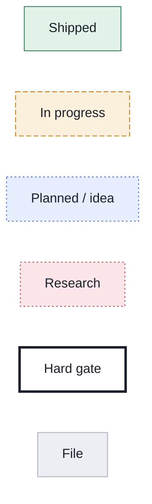
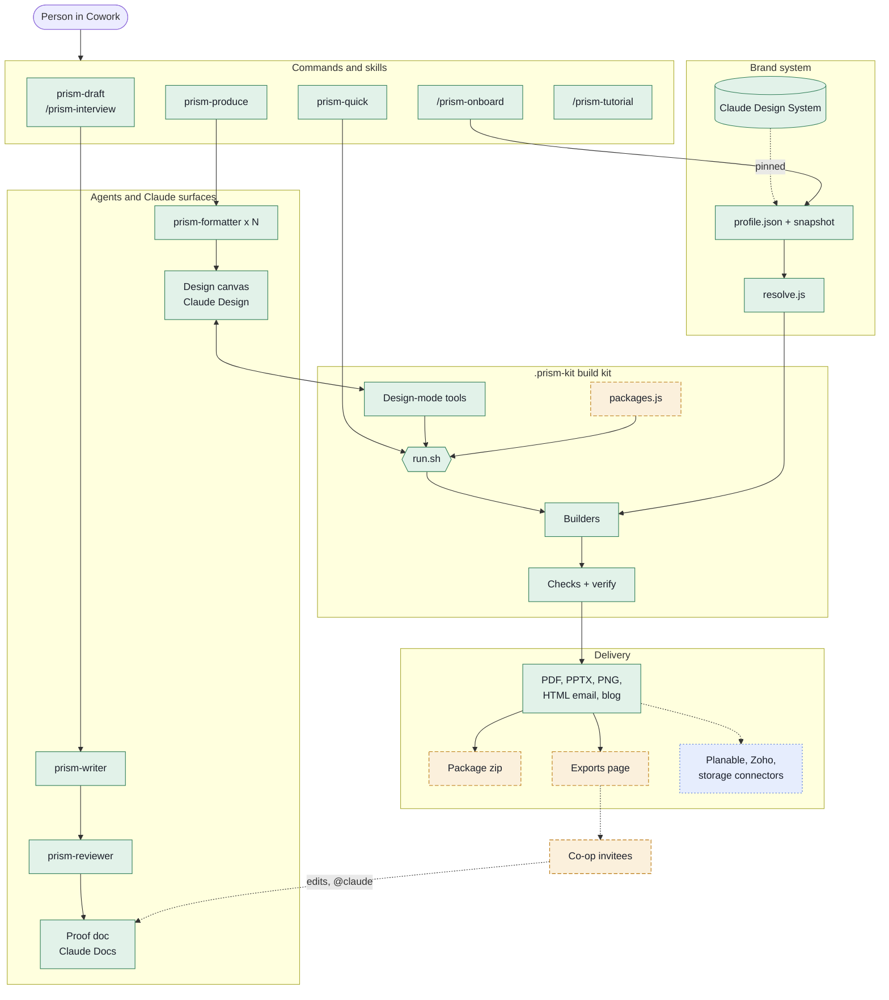
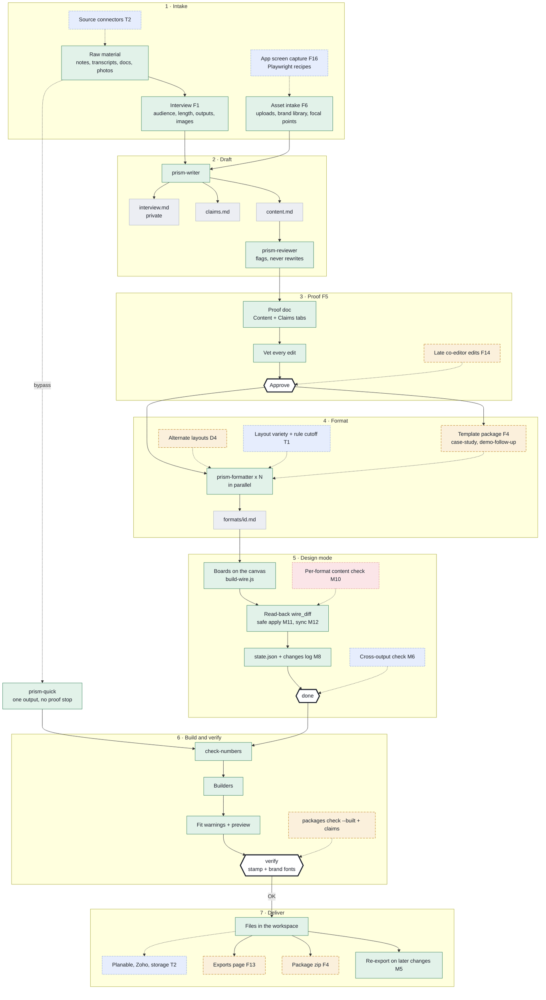
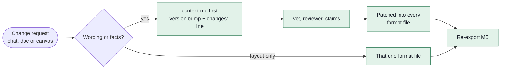
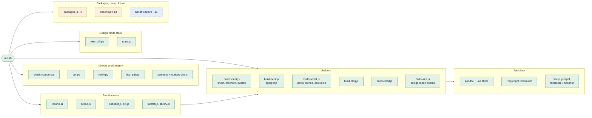
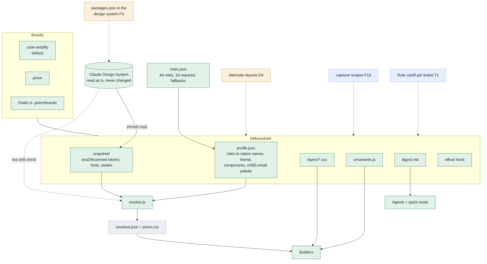
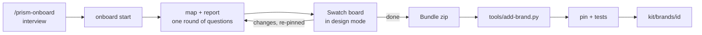
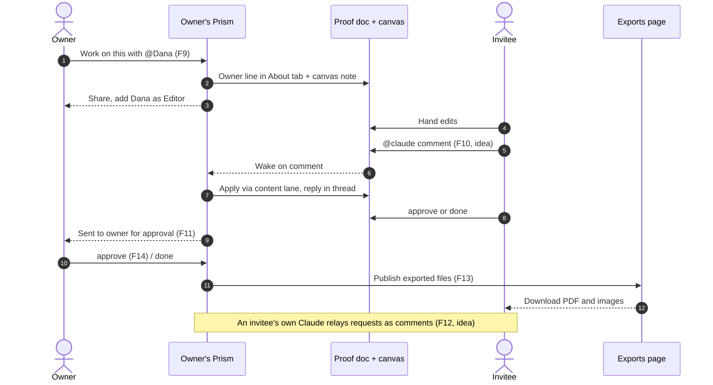
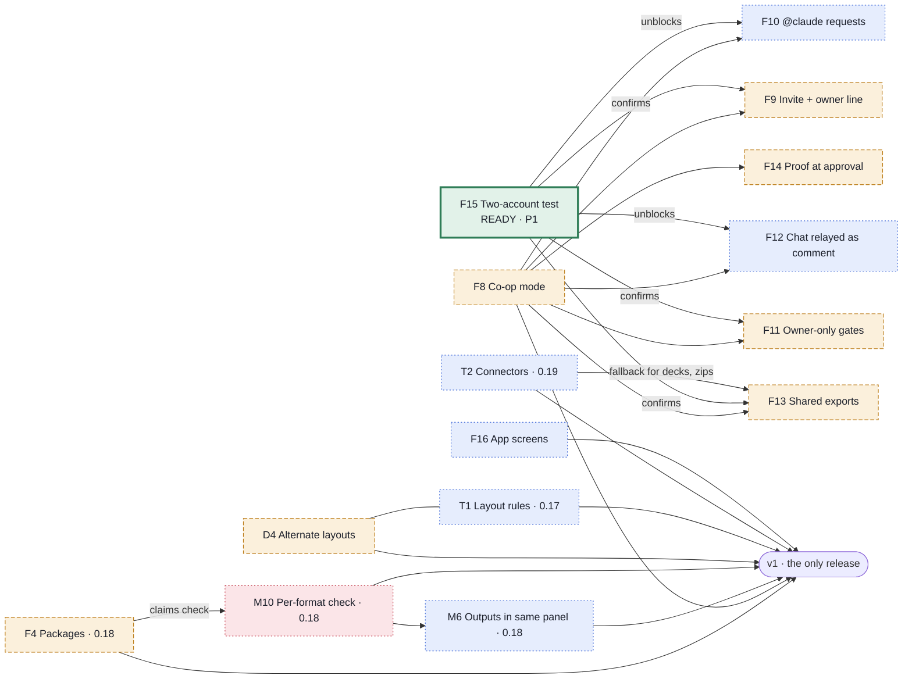

# Prism architecture

How raw material becomes proofed, on-brand files, with the backlog's future features placed where they land. State: tree `0.16.0-dev`, backlog as of 8 October 2026 (the pinned Prism Backlog artifact is the source of truth for status).

**Legend** used in every diagram:

## 1. System overview

## 2. The piece pipeline

Approval of the proof is the one hard stop; every non-destructive step after it runs on its own (F7).

### Revision lanes after approval

## 3. The build kit

`plugin/prism/skills/prism-produce/kit/`, copied into each workspace as `.prism-kit`. `run.sh` is the only entry point; each part installs its own tools on first use.

## 4. The brand system

Core is structure; brands are presentation. Core never names a brand (`tests/core-brand-free.test.py`).

### Onboarding a brand (D11)

## 5. Co-op mode (future)

The owner's Prism does all the work; invitees need edit access only. Framework merged, not yet confirmed live; the F15 two-account test decides F10 and F12.

## 6. Open backlog items

| ID | Item | Status | Pri | Target |
|---|---|---|---|---|
| F15 | Co-op two-account platform test | ready | P1 | |
| F4 | Template packages | in progress | P2 | 0.18 |
| F8 | Co-op mode (parent of F9–F15) | in progress | P2 | |
| F9 | Invite and owner line | in progress | P2 | |
| F11 | Owner-only gates and notifications | in progress | P2 | |
| F13 | Shared exports | in progress | P2 | |
| F14 | Proof doc at and after approval | in progress | P2 | |
| D4 | Alternate layouts | in progress | P3 | |
| M10 | Per-format content check | research | P2 | 0.18 |
| F10 | Invitee requests by @claude comment | idea | P2 | |
| F12 | Invitee chat relayed as a comment | idea | P3 | |
| F16 | Case Amplify app screens | idea | P2 | |
| M6 | Additional outputs in the same panel | idea | P2 | 0.18 |
| T1 | Layout variety and header-length rules | idea | P2 | 0.17 |
| T2 | Connector support (Planable, Zoho) | idea | P2 | 0.19 |

Release targets are the backlog's working labels; per the standing rule only v1 is cut.
