::: hero-image
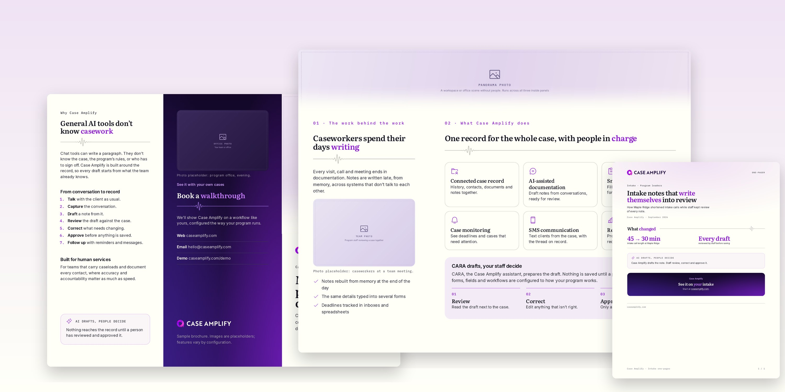{.fade .shadow}
:::

## At a *glance*

::: stats
- **8** output formats from one set of approved words
- **3** skills: draft, produce and quick
- **1** canvas to rearrange any format by hand
:::

Prism runs the Case Amplify content process for you. Bring material in any state. It drafts, flags anything that needs checking, waits for your proof, lays the approved words out in every format you ask for, opens a design canvas so you can move things around yourself, builds the files, checks them and hands them back. When you need a document right now, quick mode does all of that in one pass and lets you proof afterwards.

## How it *works* {.stack}

::: {.features .three}
- []{.icon .ph-pencil-simple-line .accent} **Draft** The writer turns raw material into plain Markdown and lists every claim with its source.
- []{.icon .ph-eye .accent} **Proof** The reviewer flags claims and brand issues. You edit and approve. Nothing is designed yet.
- []{.icon .ph-stack .accent} **Produce** One formatter per output. Then build, check, preview, verify and deliver.
:::

1. **Interview.** Optional: audience, length, outputs and photos. Skip any question and answer it later.
2. **Draft.** The writer produces `content.md` and `claims.md`.
3. **Check.** The reviewer adds inline flags. It never rewrites your copy.
4. **Proof.** You edit the words in a doc (in Claude) or in chat, and say "approve". Your edits are proofread first. This is a hard stop.
5. **Format.** Formatters lay out each output from the approved words. Design mode opens on its own before anything is built. Say "just build it" to skip it.
6. **Build and verify.** A number check, the build, fit warnings, a visual check and a brand check on every file.
7. **Deliver.** Files, previews, and a note of what each formatter cut.

> The words are approved once. Every format is built from them.
>
> [Prism design principle]{.cite}

## Two ways to *run it* {.stack}

| | Full process | Quick mode |
|---|---|---|
| Say | "Draft this into a case study" | "Quick one sheet from this" |
| Questions first | Audience, outputs, figures, photos | None; sensible defaults |
| Proof | Before anything is designed | After delivery |
| Outputs per run | Any mix, formatted separately | One |
| Number check against | Approved `content.md` | Your source material |
| Best for | Anything that will be printed, posted or sent widely | A draft for a meeting, a first look, a same-hour request |

: Say "full proof" after a quick run to move it into the full process. The quick layout is kept as the starting point.

## Quick *mode*

::: {.media .top}
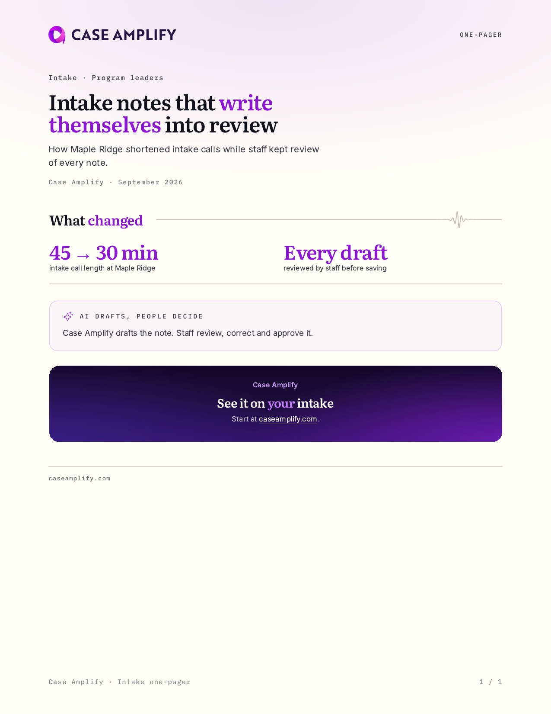

### One pass, same rules

Quick mode skips the stops, not the rules. There is no interview, no separate review passes and no proof stop.

Still enforced: no number that isn't in your source, no compliance claims, no suggestion that the AI decides, no photos of people without your permission, and the same brand check as every other build.

Every reply opens with **Quick mode: not proofed**, followed by a numbered list of every number, quote and capability claim, so you can check the piece in one read.
:::

::: band
### What happens in one pass

The build itself takes seconds; most of the wait is the writing.

::: flow
- **Write** One format file, straight from your notes.
- **Check** Every number against your source.
- **Build** With fit warnings for anything too long.
- **Look** One preview, fixing only clipped text.
- **Verify** Brand stamp and fonts, then deliver.
:::
:::

## Design *mode*

::: {.media .top}
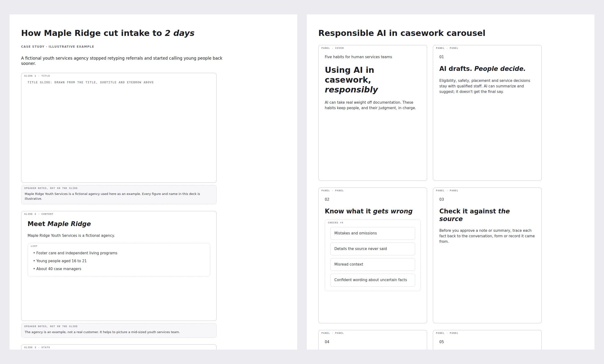

### Rearrange it by hand, rebuilt on brand

Once the layout exists, a plain wireframe opens on a Claude Design canvas, one board per format: the real words in their blocks, the real icons, each link's address, and the brand's own touches sketched in grey. Sheets, briefs and blogs flow as one page. Slides, posts, stories, emails, carousel panels and brochure panels are frames at their real proportions.

Retype a headline, drag a slide or a card row into a new order, delete a block, add a line. Then say **done**: the edits go back into the Markdown, every file is exported in the brand styles, and the canvas updates to match. After that, any change you ask for is exported again straight away. The canvas never becomes the deliverable, so nothing drifts off brand.
:::

::: {.features .three}
- []{.icon .ph-arrows-down-up .accent} **Move** Drag blocks, slides or panels. Numbered headings, carousel counters and point numbers renumber to match.
- []{.icon .ph-pencil-simple .accent} **Edit** Retype text in place. A new card title gets an icon that fits it.
- []{.icon .ph-chat-circle-text .accent} **Or just say it** "Move the chart above the table" works in chat too. Your canvas edits are picked up first, so nothing you moved is lost.
:::

## Every edit, *vetted*

Whether a change comes from the canvas, from chat or from an uploaded file, it is checked before anything rebuilds. The changed passages are proofread word by word, and the mechanical slips are caught by a checker that runs every time.

::: cols
**Fixed for you, and listed.** Spelling and grammar slips, doubled words, stray spaces, em dashes, numbering after a move, "Four findings" over three, a heading dragged away from its paragraph.

**Never changed without asking.** Numbers, names, quotes, claims and product terms, or a word that might be deliberate. Those come back as a question.
:::

Each round also adds one line per change to the `changes:` list at the top of `content.md`, so there is always a record of what changed.

::: {.callout .tint}
#### []{.icon .ph-list-checks .accent} The readback after every revision

- **What you changed:** moves, cuts, rewordings with the old and new wording, additions.
- **Fixed for you:** every correction, with what it was.
- **Left out:** notes and test lines like "TODO" or "delete me". One reply puts any back.
- **Needs your call:** anything that would change the meaning.
:::

## Trifold *brochures*

Letter paper, landscape, two sides with three panels each. Page 1 holds the inside flap, the back cover and the front cover. Page 2 is the inside, which opens as one piece.

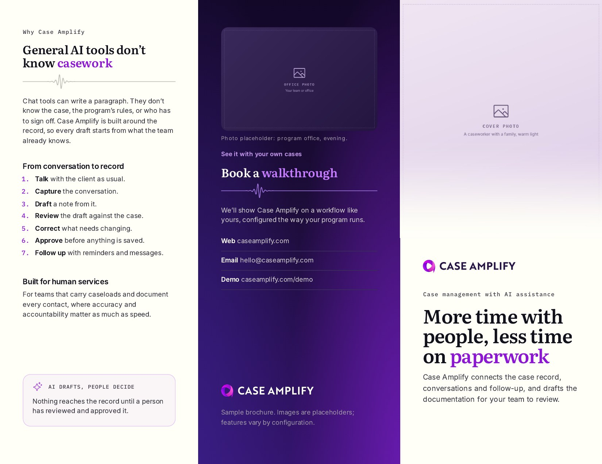

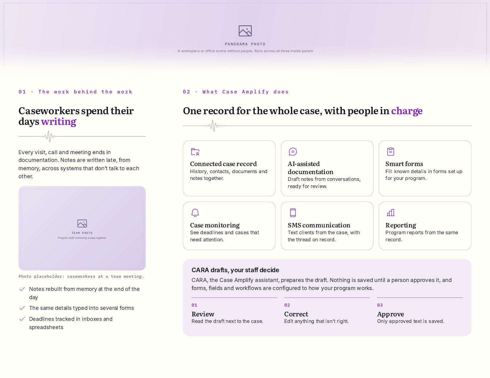

### Three inside *layouts*

| Layout | Use when |
|---|---|
| Three panels | Three separate topics, one per panel |
| Left + spread | One topic on the left, one design across center and right |
| Full spread (default) | The whole inside reads as one piece under a panoramic photo |

::: cols
**The left panel stands alone.** When the cover opens, the inside left sits beside the flap, so its text stays inside its own panel in every layout.

**Center and right flow freely.** They open together, so headings, feature cards and the tinted band with numbered steps can run across that fold.
:::

## The *outputs*

::: {.features .three}
- []{.icon .ph-file-pdf} **Sheet** PDF on Letter paper: one sheets, briefs, case studies, white papers.
- []{.icon .ph-book-open} **Brochure** Letter trifold PDF, two pages, ready for double-sided printing.
- []{.icon .ph-presentation-chart} **Deck** Editable PowerPoint with native charts, workflow slides and speaker notes.
- []{.icon .ph-instagram-logo} **Social** Square, portrait and wide images, with paste-ready post copy.
- []{.icon .ph-envelope-simple} **Email** Headers at 2x with subject lines and preheaders.
- []{.icon .ph-cards} **Carousel** Panels joined by one continuous wave line.
- []{.icon .ph-device-mobile} **Story** 1080×1920 vertical, with text kept inside the app's safe area.
- []{.icon .ph-article} **Blog** Header image, chart images, and the post body ready for WordPress.
:::

::: gallery
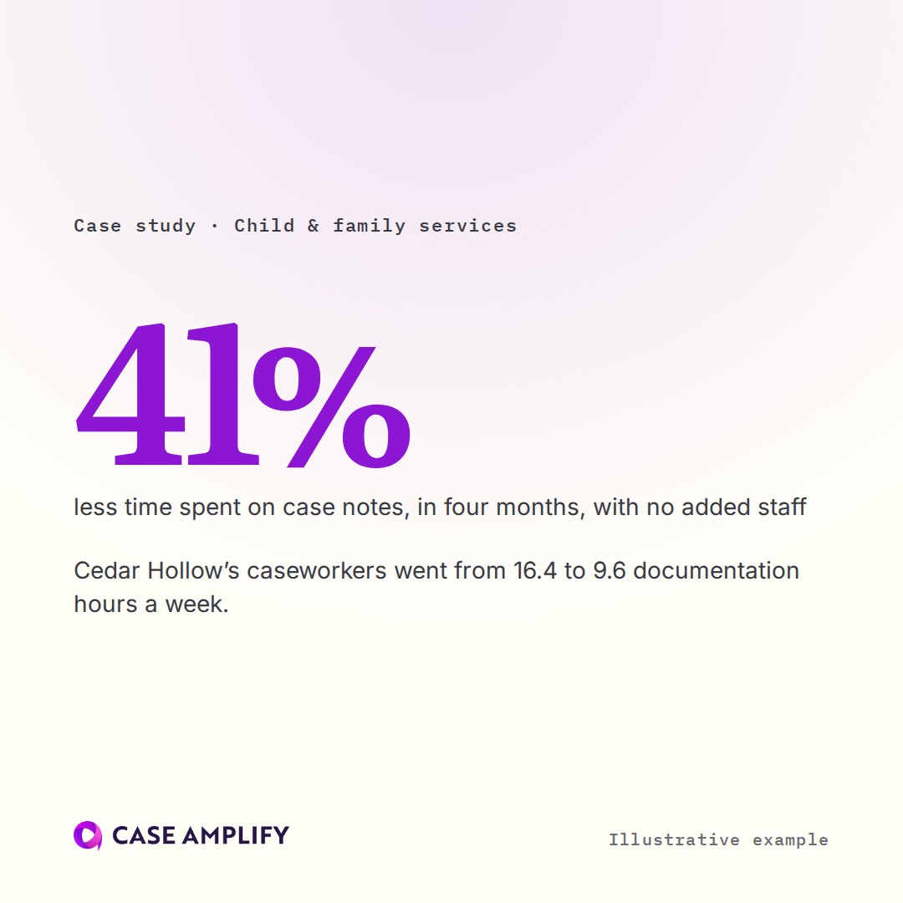

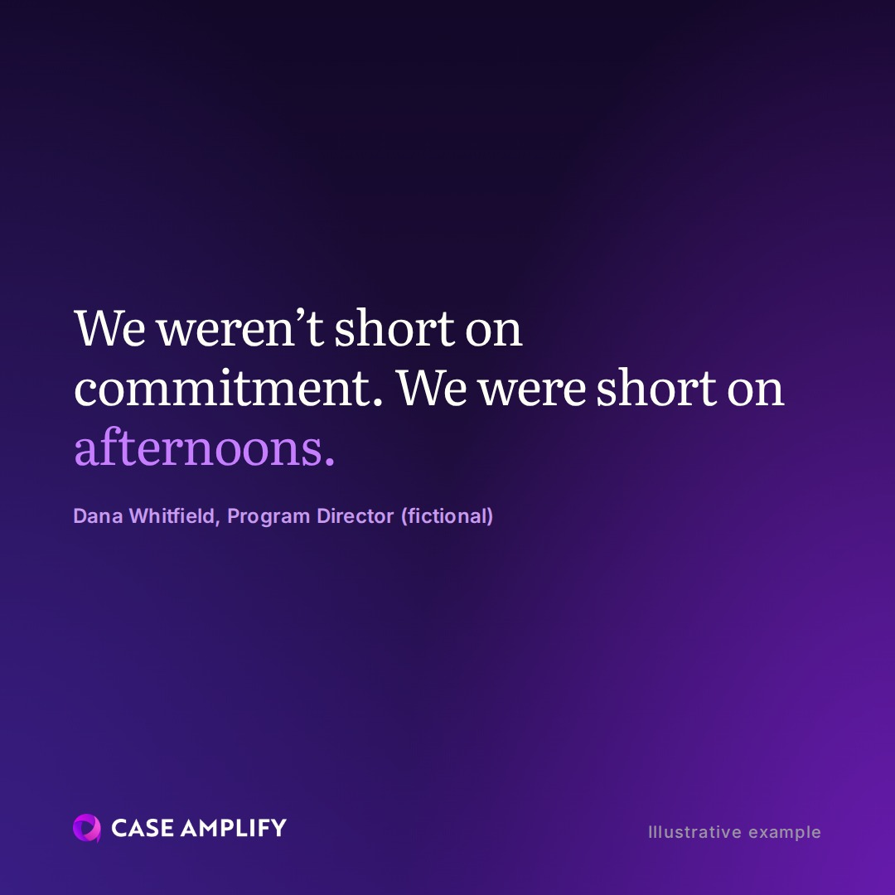

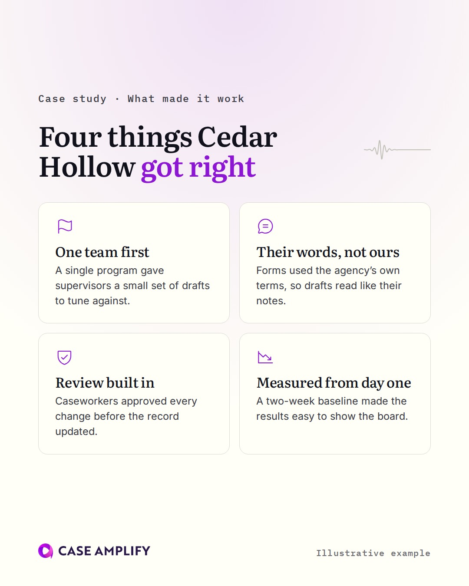
:::


### Stories, built around the app's own buttons

Instagram and Facebook cover the top and bottom of a story with their own controls. Story text stays inside the safe area, and the build flags anything that strays outside it or runs into the logo. Photos can fill the top, the whole frame (faded into the colour), or sit on a card.

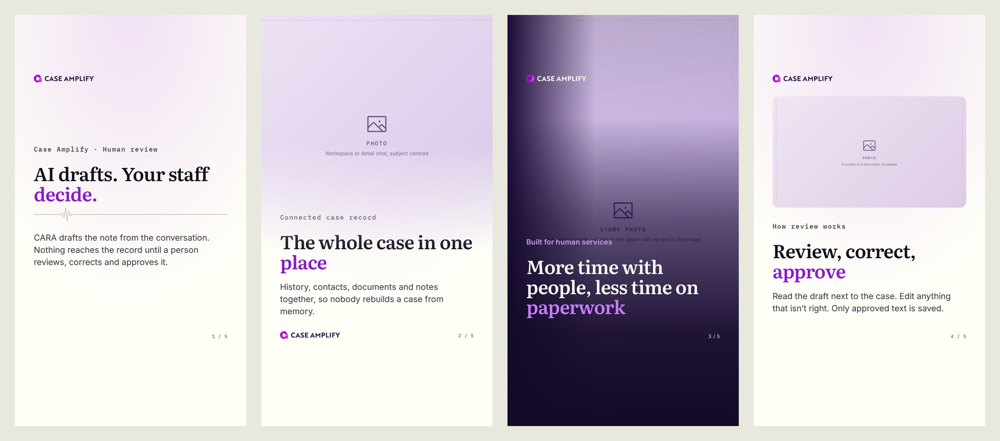

### Blog headers that don't repeat the page

The blog already shows the title, author, tags and logo, so the header carries none of them. It is one of four things: a broad brand gradient (the default, different for every post), your photo faded into the gradient, a real product screenshot on a card, or a series name such as Changelog with its release line.

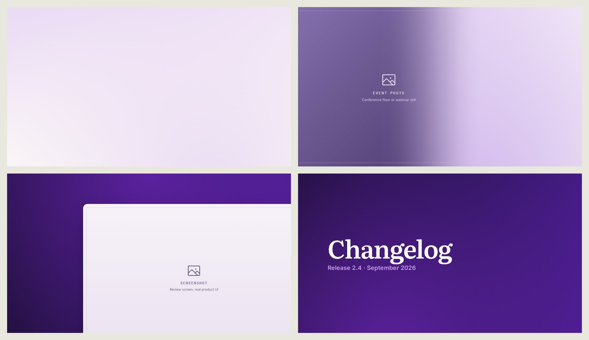

::: {.media .flip}
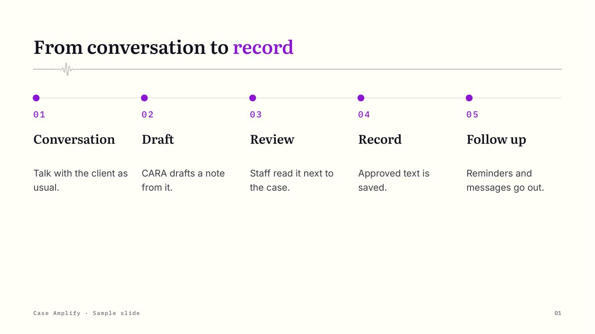

### Process stories as workflows

A deck's steps slide takes three to five steps and draws them as one line with a dot per step. Sheets and brochures have the same idea as a `flow` block, like the one on the quick mode page. Use them wherever the story is a sequence: conversation, draft, review, record, follow-up.
:::

::: callout
#### []{.icon .ph-files} Every file has one job

- **PDF, PPTX or PNGs:** the finished piece.
- **`captions.md`:** the post copy to paste with each image of the same name.
- **The format file:** the editable source for that output. For social it holds the image text and the caption together; edit it and ask for a rebuild.
- **Blog `post.html`:** the body, charts as images, ready to paste into WordPress.
:::

## Built on brand, *every time*

::: {.features .three}
- []{.icon .ph-path .accent} **One route** Every Case Amplify file is built through the plugin's kit. Never a generic PDF or slides tool, never approximated colours or fonts.
- []{.icon .ph-seal-check .accent} **Stamped and verified** Each PDF and PowerPoint carries a Prism stamp; a verify step checks it and the fonts before delivery.
- []{.icon .ph-ruler .accent} **Fit warnings** Decks and brochures report any text that won't fit its box or panel, before anyone opens the file.
:::

::: {.callout .tint}
#### []{.icon .ph-sparkle .accent} Call it whatever you call it

One sheet, one-pager, flyer, handout, leave-behind, fact sheet, brochure, slides, PowerPoint, social post, story, blog header. Every name routes to Prism, so the brand kit is always the one doing the work.
:::

## In Claude and *ChatGPT*

The same skills, formats, brand rules and build kit run in both. What differs is how the work is run and delivered.

| | Claude (Cowork) | ChatGPT |
|---|---|---|
| Writer, reviewer, formatter | Separate agents; formatters run in parallel | Separate passes, one after another |
| Questions | A multiple-choice card | One message of numbered questions |
| Files | Sent to the chat, or saved to a connected folder | Download links |
| Design mode | A Claude Design canvas for every format | Layout changes described in chat |
| Edit check and readback | Yes | Yes |
| Install | Upload the plugin zip in Customize › Plugins | Upload the ChatGPT zip in the Upload plugin menu |

Setup happens on the first build of each output type and checks only what that type needs, so a one sheet never waits for deck tools. Anything missing is installed from the package registries, with a time limit on every step.

```chart
type: hbar
caption: Build timings in seconds, measured in this build session. Model writing time not included.
unit: s
Deck build, graphics cached: 0.6
First sheet, setup included: 2.5
Deck build, first time: 2.6
First sheet, installing everything: 33
```

## The layout *toolkit* {.stack}

| Component | Use it for | Works in |
|---|---|---|
| Stats | Two to four headline figures | Sheet, brochure, deck, social, email, carousel |
| Feature cards | Parallel points with an icon each | Sheet, brochure, deck, social |
| Callout | The main takeaway (tinted) or a caveat (plain) | Sheet, brochure, social |
| Band and flow | One key idea with two to five numbered steps | Sheet, brochure |
| Steps slide | A three- to five-step workflow | Deck |
| Checklist, columns | Short lists, side-by-side text | Sheet, brochure, social, carousel |
| Pull quote | A verbatim quote, never beside the wave | All |
| Charts | Bar, horizontal bar, line, donut | Sheet, social, deck (native) |
| Images | Hero, media row, gallery, figure, spread photo | Sheet, brochure, deck, social, email |
| Closing card | The one dark card, in three sizes | Sheet |

### Charts from a few lines of *Markdown*

The data lives in the Markdown, so there is only one copy of it. This one was written that way.

```chart
type: donut
caption: What the plugin is made of, by size in KB. Measured from the 0.12.1 package.
center: 3.5 MB | in total
unit: KB
Phosphor icons: 1759
Images and backgrounds: 848
Brand fonts: 660
Build scripts and styles: 192
Instructions: 98
```

## What it *checks*

::: checks
- Every number in every output appears in the approved words, or in your source in quick mode
- Every edit is proofread, renumbered and read back before the rebuild
- Story text stays inside the safe area
- Every PDF and PowerPoint was built by the kit and uses only the brand fonts
- Deck text and brochure panels fit their boxes
- One sheets fit one page: compact title and card first, then cuts, never smaller type
- Brochures are exactly two pages
- Every social post and carousel has post copy in `captions.md`
- Illustrative pieces carry a fictional label on every output
- Photos print at 150 dpi or better, or move to a smaller layout
- No wave rule with more than one burst, and no wave beside a person
- No transparency in PDFs, so every viewer shows the same colours
:::

## Tips and *tricks* {.stack}

### Asking

::: cols
**Say who it's for and what they should do next.** "For county program directors; they should book a demo" shapes every section better than a longer brief.

**Want to give the whole brief at once?** Say "interview me first" (or `/prism-interview` in Claude) and every question comes up front, before anything is drafted.

**Name the outputs up front.** "A case study as a sheet, a deck and a carousel" lets the interview skip a question and the formatters plan cuts together.
:::

```
Quick one sheet from these notes, for supervisors, ending on a demo invite.
Draft this into a case study. I want a sheet, a brochure and three posts.
Make a trifold with the left + spread inside layout.
```

### Proofing

- **Proof the words once, carefully.** In Claude they open in a doc you edit directly; your interview answers never go in it. It is the only place words change. Layout feedback can wait and won't disturb the words.
- **Read the claims ledger before the prose.** Every number and quote is listed with its source; a row marked VERIFY is the first thing to settle.
- **Say "keep it as is" to accept a flag.** Approval is refused while flags remain, so that choice is always yours.

### Getting the layout you want

- **Use the canvas for arrangement, chat for intent.** Drag things where you want them; say "make the quote post dark" for a styling choice the wireframe can't show.
- **Say done once.** Make your first round of canvas edits and chat requests, then say done for the files. After that, every change exports straight away.
- **Talk in layout terms for layout changes.** "Move the chart above the table", "make the quote post dark" or "use the three-panel inside" touch only that one output.
- **Tell a process as a flow.** "Show it as steps" gets a workflow slide or flow block instead of a row of feature cards.
- **Tight one sheet?** Ask for `hero: x-small` and the slim closing card before cutting words.
- **Brochure photos:** a panoramic photo about 6.5:1 for a full spread, a portrait or square one for the cover. Keep people out of spread photos, since a wave header sits under them.
- **Headings over a fold:** check the preview for a word on the crease and shorten the heading if one sits there.

### Social and email

- **Edit the format file, not `captions.md`.** Captions are rebuilt from the format file every time.
- **Keep text on the image short.** An eyebrow, a heading or stat, one sentence. The caption carries the rest.

### Photos

- **Upload photos with the notes, or later.** You'll be asked which one leads, which to use, and whether the people in them can be shown. Photos can be added at any point, in design mode too.
- **Crops keep the subject.** Every layout crops a photo around its focal point. If one misses, say "keep her face in frame".
- **Reusable photos belong in the brand library.** Team, office and product shots added to the design system can be used in any piece.
- **Send the largest file you have.** Anything that prints under 150 dpi is moved to a smaller layout or left out of print.

### Quick mode

- **Paste the numbers you want used.** Quick mode only uses figures that appear in your source, so a missing number means a missing stats block.
- **Use it for the first look, then promote it.** "Full proof" turns a quick piece into the full process without losing its layout.

### If something looks off

- **Ask for a verify.** "Verify this file" checks that it came from the kit and uses only brand fonts. A file that fails was made some other way; ask for a rebuild through Prism.

## Known *limits*

::: callout
#### []{.icon .ph-warning} Worth knowing before you rely on it

- **Fonts in PowerPoint.** Decks need CA Literata, CA Inter and CA Mono installed to edit or present. Send a PDF to anyone who doesn't have them.
- **Quick mode isn't proofed.** Treat its output as a draft until someone has checked the claims list.
- **Fit warnings are estimates.** They catch most overflows; the preview is still the final word, and deck previews need LibreOffice.
- **Latin characters only, Letter size, transcripts not audio.** A4 means changing one line in the stylesheet; voice memos need transcribing first.
- **Files built before 0.6.1 fail verify.** They carry no stamp; rebuild them to check them.
- **Design mode is Claude only, and not in quick mode.** In ChatGPT, describe layout changes in chat. Say "design mode" after a quick run to open it.
- **The canvas sets order and words, not style.** Colours, sizes and styling on the canvas are ignored; the kit styles everything.
- **Sessions end.** Save the files you want to keep, or connect a folder.
:::

::: {.cta-card .x-small}
[Try it]{.eyebrow}

## Attach your notes and say *draft this*, or *quick*

The plugin handles the rest, and stops for you where it matters.
:::
